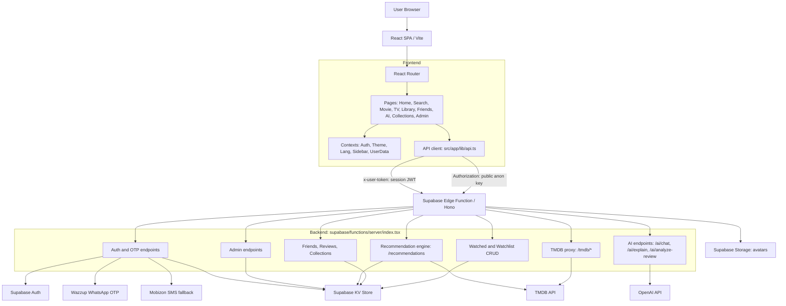
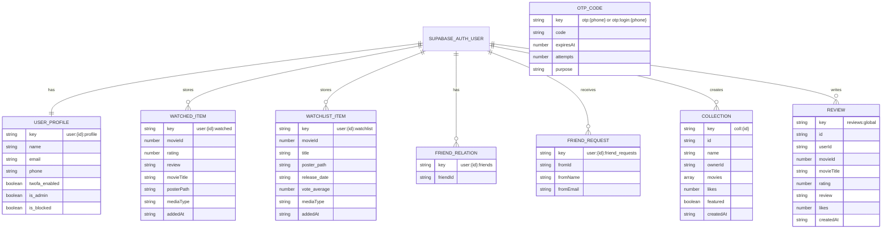
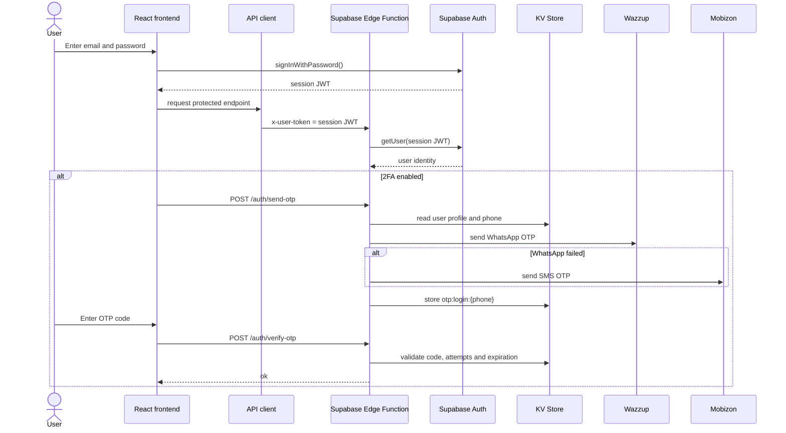
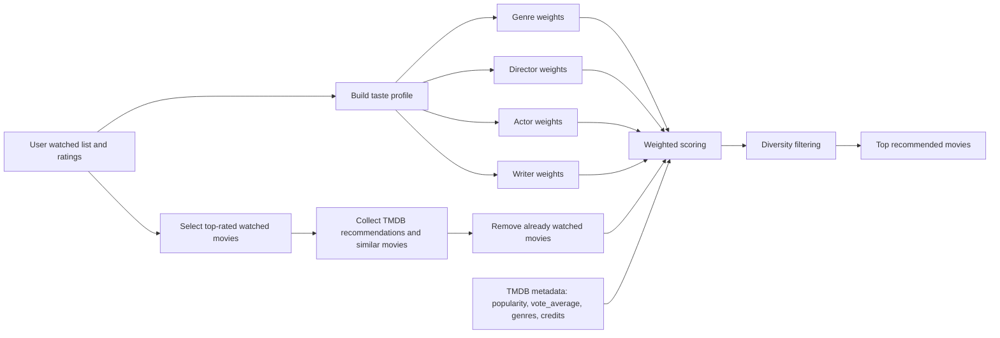
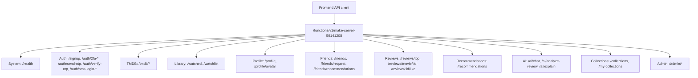

# Correct diagrams for Qaradakor.kz

Эти диаграммы построены на основе фактических файлов проекта:

- `src/app/routes.tsx`
- `src/app/lib/api.ts`
- `supabase/functions/server/index.tsx`
- `supabase/functions/server/kv_store.tsx`

Текущая страница `/uml` в приложении в целом полезная, но содержит неточности:

- Использует несуществующий endpoint `/ai/recommend`.
- В Auth Flow указаны `/otp/send` и `/otp/verify`, но в коде реальные маршруты находятся в `/auth/...`.
- В админской модели указан `admins:list`, но фактически admin-флаг хранится в `user:{id}:profile.is_admin`.
- Base URL местами указан неточно.
- Модель данных не включает часть фактических ключей KV.

## Figure 3.1 - Overall architecture of Qaradakor.kz



Recommended text:

```text
Figure 3.1 shows the overall architecture of the Qaradakor.kz platform. The frontend is implemented as a React single-page application and communicates with a Supabase Edge Function through a centralized API client. The backend function is built with Hono and contains modules for authentication, TMDB proxying, user library management, social functionality, recommendations, AI features and administration. Persistent user data is stored in Supabase Auth, Supabase Storage and a PostgreSQL-based KV store, while external functionality is provided through TMDB, OpenAI, Wazzup and Mobizon APIs.
```

## Figure 3.2 - Data storage model



Recommended text:

```text
Figure 3.2 presents the data storage model of the system. The application does not rely on a traditional public users table for domain data. Instead, authentication identities are managed by Supabase Auth, while user-specific application data is stored in the KV store under structured keys. This approach allows the system to store flexible JSON objects for profiles, watched movies, watchlists, friends, reviews, collections and OTP codes while keeping authentication and storage concerns separated.
```

## Figure 3.3 - Authentication and 2FA flow



Recommended text:

```text
Figure 3.3 illustrates the authentication and two-factor verification flow. The application uses Supabase Auth for the primary email and password login. The resulting session token is passed to the Edge Function through the x-user-token header. If two-factor authentication is enabled, the backend generates a one-time code, stores it in the KV store and attempts delivery through Wazzup WhatsApp first, falling back to Mobizon SMS if needed.
```

## Figure 3.4 - Recommendation pipeline



Recommended text:

```text
Figure 3.4 shows the recommendation pipeline implemented in the backend. The system builds a taste profile from the user's watched movies and ratings, collects candidate movies from TMDB recommendation and similar-movie endpoints, removes already watched items and ranks the remaining candidates using weighted genre, director, actor, writer, popularity and rating signals. A diversity filtering step is then applied to avoid repetitive recommendations.
```

## Figure 3.5 - Backend API groups



Recommended text:

```text
Figure 3.5 groups the backend API endpoints by functional responsibility. All backend calls are served by a single Supabase Edge Function route prefix. Public endpoints are used for health checks, signup, TMDB proxying and public collection/review views, while protected endpoints require a valid Supabase session token in the x-user-token header. Administrative endpoints additionally require the is_admin flag in the user's profile.
```

## Notes for Word insertion

When adding these diagrams to Word:

1. Render Mermaid diagrams as PNG or SVG.
2. Insert each diagram as an image.
3. Put the caption below the image.
4. Use consistent numbering:
   - `Figure 3.1 - Overall architecture of Qaradakor.kz`
   - `Figure 3.2 - Data storage model of Qaradakor.kz`
   - `Figure 3.3 - Authentication and 2FA flow`
   - `Figure 3.4 - Recommendation pipeline`
   - `Figure 3.5 - Backend API endpoint groups`
5. Reference each figure before it appears in the text.

